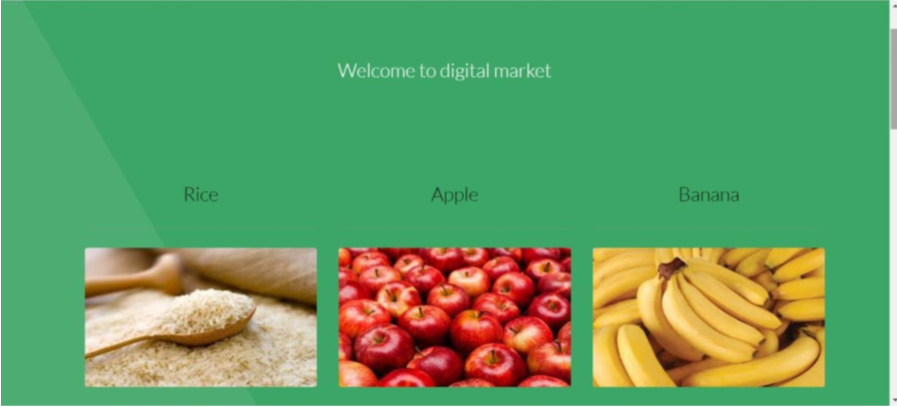
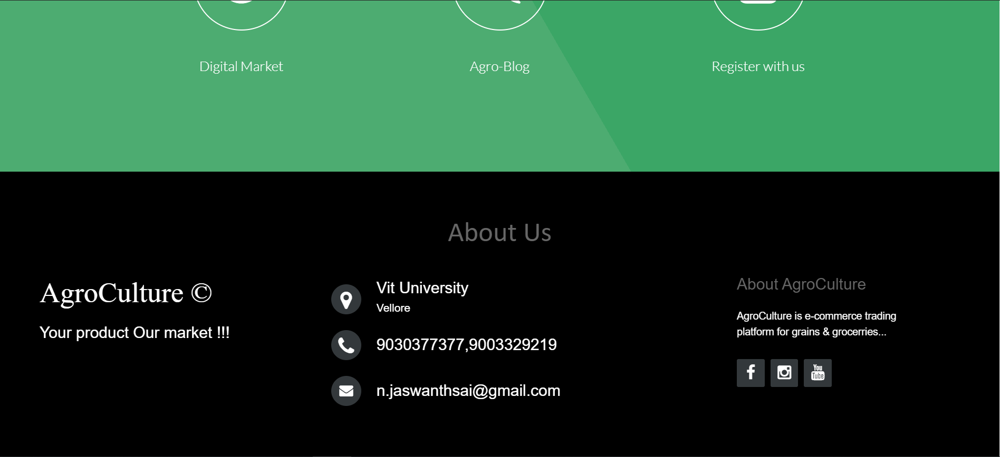

# AgroCulture

The Agricultural Marketing and Interaction Portal (AMIP) site is planned to give clients access to the various number of fresh agricultural products. Farmers with cultivating different types of products can market their products through website.

# Softwares required:
1.xampp or wamp  
2.Any text editor 

# How to Run

**Step 1 :** Install the required softwares

**Step 2 :** Starting Apache and MySQL in XAMPP

**Step 3 :** Extract file and Paste in xampp/htdocs/

**Step 4 :** Open a browser and go to URL “http://localhost/phpmyadmin/”

**Step 5 :** Then, click on the databases tab Create a database naming “ AgroCulture ” and then click on the import tab

**Step 6 :** Browse for AgroCulture.sql and import it.

**Step 7 :** Open a browser and go to localhost/AgroCulture

# Technology Used:

PHP 
CSS  
Bootstrap 
JavaScript 
Sql 

# ScreenShoots

